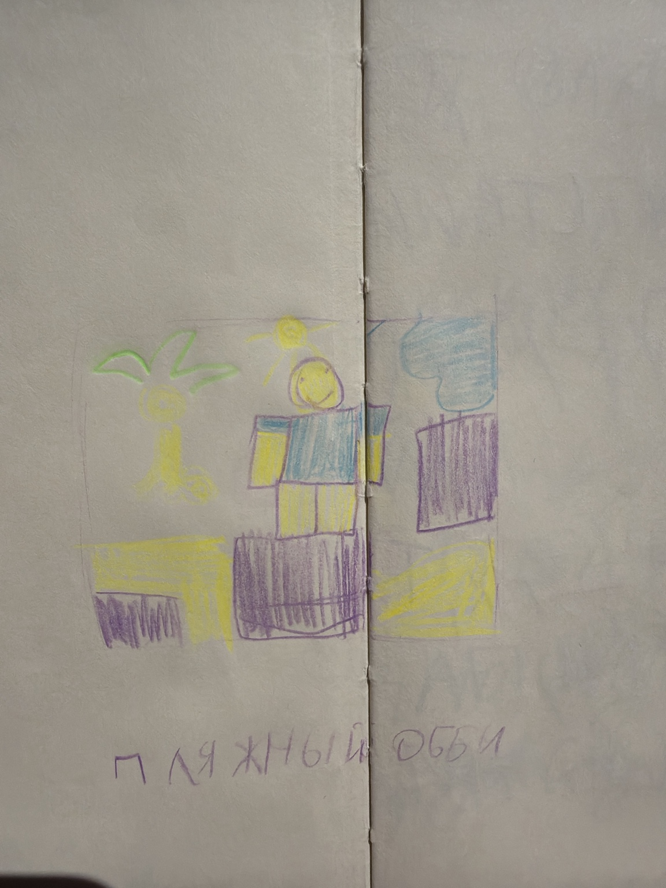
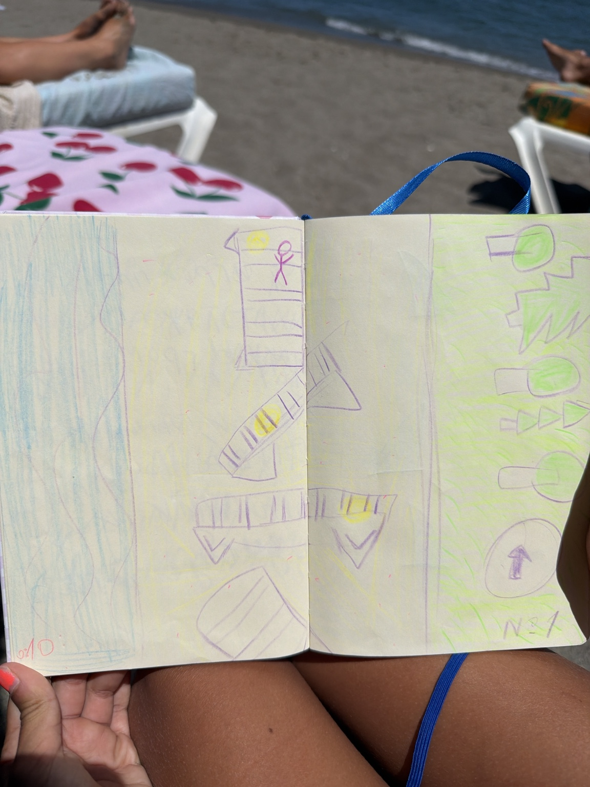
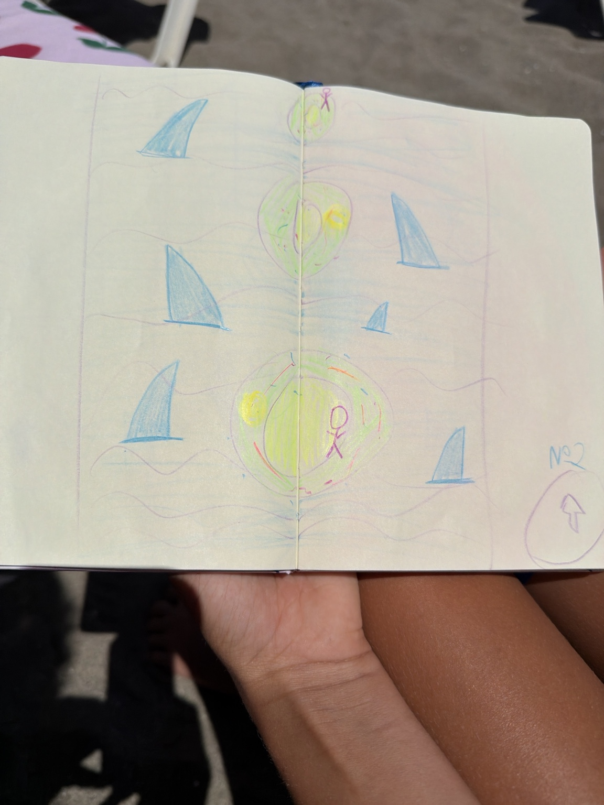
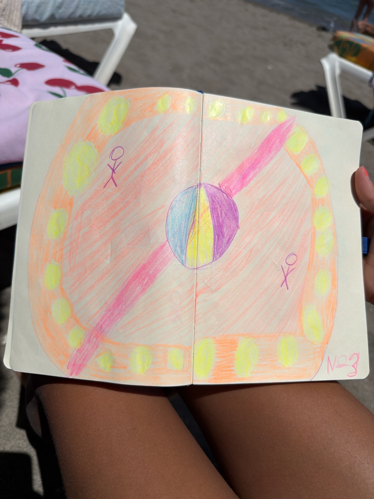
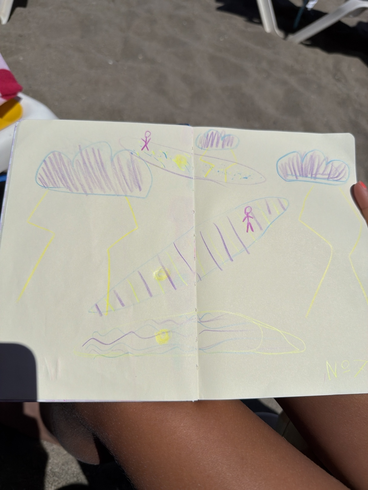
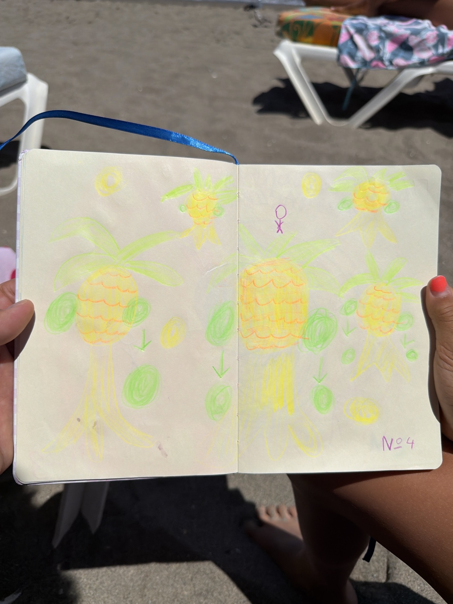
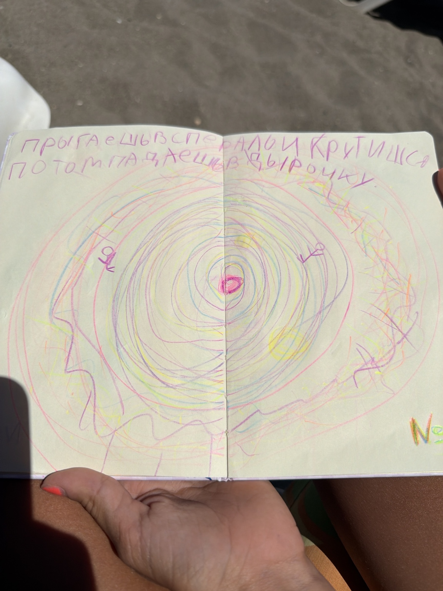
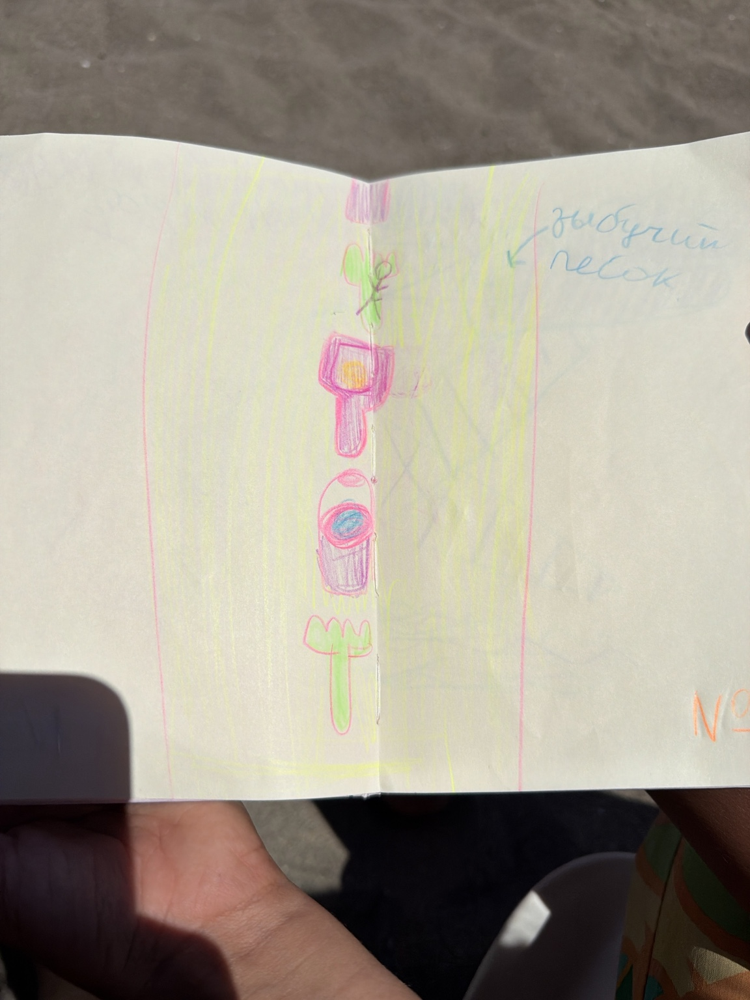

# Пляжный Обби — MVP

Этот документ объединяет требования из `Beach_Obby_MVP_Specification_RU.docx` и визуальные референсы из `visuals/`. Текст DOCX имеет приоритет. Эскизы уточняют визуальное направление, но их случайные детали, цвета, пропорции и количество объектов не становятся обязательными требованиями.

## Оглавление

1. [Концепция игры](#1-концепция-игры)
2. [Целевая версия MVP](#2-целевая-версия-mvp)
3. [Общие игровые правила](#3-общие-игровые-правила)
4. [Игровой цикл](#4-игровой-цикл)
5. [Интерфейс](#5-интерфейс)
6. [Сцены MVP](#6-сцены-mvp)
7. [Чекпоинты и поражение](#7-чекпоинты-и-поражение)
8. [Монеты](#8-монеты)
9. [Таймер и завершение забега](#9-таймер-и-завершение-забега)
10. [Таблицы результатов](#10-таблицы-результатов)
11. [Что не входит в MVP](#11-что-не-входит-в-mvp)
12. [Критерии готовности](#12-критерии-готовности)
13. [Неоднозначности и открытые вопросы](#13-неоднозначности-и-открытые-вопросы)
14. [Карта визуальных референсов](#14-карта-визуальных-референсов)

## 1. Концепция игры

«Пляжный Обби» — короткое линейное семейное приключение в Roblox. Игрок последовательно проходит пляжные препятствия, при желании собирает монеты и старается улучшить итоговое время.

- Жанр: Obby.
- Платформа: Roblox.
- Целевая длительность первого успешного прохождения: 3–6 минут.
- Целевая аудитория: дети и семейные игроки.
- Управление должно быть удобным на телефоне, планшете и ПК.
- Главный мотив повторного прохождения: улучшение времени и сбор большего количества монет.
- Визуальный тон: яркий, доброжелательный, немного наивный, основанный на детских рисунках.

### Визуальные требования

- **Обязательные требования документа:** пляжная тема, яркий доброжелательный тон, простые формы и сохранение характера детских рисунков вместо безликого реалистичного оформления.
- **Приблизительные особенности эскиза:** видны блочный персонаж, пальма, солнце и несколько крупных цветных геометрических форм. Конкретные цвета, расположение форм и нарисованные пропорции не обязательны.
- **Файл:** `image01.jpeg`.

## 2. Целевая версия MVP

### 2.1. Состав первой версии

В MVP входят:

- безопасная стартовая зона и стартовая линия;
- сцена 1 — горячий пляж с маршрутом по лежакам;
- сцена 2 — переход по надувным кругам среди акул;
- сцена 3 — круглый остров с вращающимися лазерами;
- финал — подъём по круговой лестнице большой пальмы;
- чекпоинт в начале каждой сцены и у основания финальной пальмы;
- единая система опасностей, смерти и возрождения;
- таймер полного прохождения;
- необязательные монеты;
- HUD, итоговый экран и повторный запуск;
- личный лучший результат, постоянно доступная таблица текущего сервера и релизный глобальный Top-10 в объёме, описанном в разделе 10.

Прохождение строится сначала как сквозной серый прототип из примитивов. Художественные модели и декор подключаются после проверки полного игрового цикла.

### 2.2. Стартовые значения прототипа

| Параметр | Стартовое значение | Примечание |
|---|---:|---|
| Общее число монет | 16–25 | Включает первую демонстрационную монету и 15–24 монеты сцен и финала |
| Движущиеся человечки в сцене 1 | 2–3 | Движение туда-сюда по линии |
| Лазерная перекладина | 1 | Проходит через центральный шар и образует два противоположных луча |
| Скорость лазера | Один оборот за 5–7 секунд | Движение должно быть понятным новичку |
| Среднее время сцены | 30–60 секунд | Без учёта смертей |
| Подъём на пальму | 20–40 секунд | Финал не должен быть затянут |
| Размер глобальной таблицы лидеров | 10 игроков | Отдельные Top-10 по времени и монетам через `OrderedDataStore` |

### 2.3. Технические границы

- Сервер является источником истины для старта и финиша, порядка чекпоинтов, состояния таймера, монет, опасностей и результатов.
- Клиент отвечает за HUD и локальные визуальные эффекты, но не подтверждает результат самостоятельно.
- Общий код и RemoteEvents размещаются в `ReplicatedStorage`, серверный код — в `ServerScriptService`, клиентский — в `StarterPlayerScripts` или `StarterGui`.
- Для общих систем рекомендуется использовать теги `Checkpoint`, `Coin`, `Hazard` и `Finish`; отдельная логика смерти для каждой опасности не создаётся.
- Движение критичных препятствий должно задаваться предсказуемым Tween или скриптом, а не свободной физикой.
- Рекомендуемые серверные состояния игрока: активность забега, серверное время старта, текущий чекпоинт, набор уникальных собранных монет, число монет, лучшее время, лучший результат по монетам и время соответствующего забега.

Рекомендуемые названия общих событий и систем из исходной спецификации можно изменить без изменения границ ответственности: `RunStarted`, `CheckpointReached`, `CoinCollected`, `RunFinished`, `GameSessionService`, `CheckpointService`, `CoinService`, `LeaderboardService`, `HazardService` и `HUDController`.

## 3. Общие игровые правила

1. Прохождение линейное: игрок не выбирает уровни и не может пропустить сцену.
2. Каждый переход должен визуально показывать следующую цель.
3. Монеты необязательны; завершить игру можно с любым их количеством.
4. В начале каждой сцены активируется отдельный чекпоинт.
5. Контакт с опасностью или запрещённой поверхностью убивает персонажа и возвращает его на текущий чекпоинт.
6. Таймер начинается при старте забега, не останавливается и не сбрасывается после смерти.
7. Финиш фиксируется только один раз — при достижении вершины финальной пальмы.
8. После финиша сохраняются итоговое время и количество монет завершённого забега.
9. Движущиеся препятствия должны быть предсказуемыми и циклическими.
10. Порядок чекпоинтов, финишное время и монеты проверяются сервером.

## 4. Игровой цикл

Основной маршрут:

**Старт → горячий пляж → круги и акулы → лазерный остров → пальма-финиш**

1. Игрок появляется в безопасной стартовой зоне.
2. Пересечение стартовой линии запускает серверный забег и таймер.
3. Игрок проходит сцены строго по порядку; в начале очередной сцены активируется её чекпоинт.
4. При смерти игрок возвращается на текущий чекпоинт. Таймер и уже собранные монеты сохраняются.
5. Игрок при желании собирает монеты, не прерывая линейное прохождение.
6. Касание финишного объекта на вершине пальмы завершает забег один раз.
7. Таймер останавливается, сервер фиксирует результат, а клиент показывает итоговый экран.
8. Команда повторного запуска создаёт новый чистый забег.

## 5. Интерфейс

| Элемент | Размещение | Состояния | Минимальное содержание |
|---|---|---|---|
| Таймер | Верхний угол | Идёт / остановлен | Формат `00:00.00` |
| Монеты | Рядом с таймером | От `0` до количества монет на маршруте | Иконка монеты и число |
| Название сцены | Кратко при входе в сцену | Появляется и исчезает | Например, «Горячий пляж» |
| Итоговый экран | По центру после финиша | Модальный | Время, монеты, личный рекорд, кнопка повторить |
| Таблица рекордов | В стартовой или финальной зоне | Постоянно | Таблица текущего сервера; в релизном MVP также глобальные Top-10 по времени и монетам |

HUD представляет серверное состояние, но не является источником истины. Интерфейс и управление проверяются как минимум на Windows-компьютере и на одном планшете или телефоне.

## 6. Сцены MVP

### 6.1. Стартовая зона

- **Цель:** понять направление движения и запустить забег.
- **Геометрия:** небольшой безопасный участок пляжа перед первой сценой; видны море, лес и первая линия лежаков.
- **Опасности:** отсутствуют.
- **Монеты:** одна демонстрационная монета; при сборе она входит в итоговый счёт забега.
- **Чекпоинт:** начальный `SpawnLocation`, который одновременно является чекпоинтом первой сцены и расположен перед первым лежаком.
- **Завершение:** игрок пересекает стартовую линию, после чего таймер появляется и начинает отсчёт.

### 6.2. Сцена 1 — Горячий пляж

- **Цель:** пересечь пляж, прыгая по лежакам и не касаясь песка.
- **Геометрия:** линейная цепочка лежаков и безопасных предметов; с одной стороны море, с другой лес.
- **Целевая длительность для новичка:** 30–45 секунд.
- **Опасности:** горячий песок; 2–3 простых движущихся человечка, которые следуют по заранее заданным линиям и убивают или сбрасывают при контакте.
- **Монеты:** 3–5 над безопасным маршрутом; одна монета может требовать более рискованного прыжка.
- **Чекпоинт:** начальный `SpawnLocation` перед первым лежаком; это тот же чекпоинт, который используется в стартовой зоне.
- **Завершение:** безопасная площадка у воды и активация чекпоинта сцены 2.

#### Визуальные требования

- **Обязательные требования документа:** линейный маршрут по лежакам и безопасным предметам, море с одной стороны, лес с другой, горячий песок и простые движущиеся человечки.
- **Приблизительные особенности эскиза:** вид сверху, широкая голубая область по одному краю, зелёная область с условными растениями по другому, несколько фиолетовых полосатых прямоугольных платформ и схематичные фигурки. Точное число, форма, угол и цвет платформ не обязательны.
- **Файл:** `image02.jpeg`.

### 6.3. Сцена 2 — Надувные круги и акулы

- **Цель:** добраться через воду до круглого острова.
- **Геометрия:** цепочка надувных кругов разного размера и с разными расстояниями между ними.
- **Проходимость:** основной маршрут всегда проходится обычным прыжком Roblox без специальных ускорений.
- **Опасности:** падение в воду убивает; акулы в воде служат визуальной и контактной угрозой.
- **Монеты:** 4–6 над кругами или между ними; они не должны требовать непредсказуемого прыжка.
- **Чекпоинт:** последняя безопасная площадка первого пляжа перед первым кругом.
- **Завершение:** игрок ступает на круглый остров и активирует чекпоинт сцены 3.

#### Визуальные требования

- **Обязательные требования документа:** водная зона, последовательность надувных кругов, акулы как визуальная и контактная угроза и читаемый маршрут к острову.
- **Приблизительные особенности эскиза:** голубое поле с волнистыми линиями, несколько зелёных круглых объектов, синие акульи плавники, схематичные персонажи и жёлтые отметки, похожие на монеты. Их точное количество, масштаб и расположение не обязательны.
- **Файл:** `image03.jpeg`.

### 6.4. Сцена 3 — Лазерный остров

- **Цель:** собрать желаемые монеты и пройти к выходу, избегая вращающихся лазеров.
- **Геометрия:** круглый остров с шаром в центре; выход находится на противоположной стороне.
- **Опасности:** одна горизонтальная перекладина понятной высоты проходит через центральный шар, вращается вокруг него и визуально образует два противоположных лазерных луча; касание любого луча и падение в воду убивают.
- **Настройка прототипа:** ориентировочная скорость перекладины — один оборот за 5–7 секунд.
- **Монеты:** 5–8 по периметру; сбор всех монет для выхода не требуется.
- **Чекпоинт:** у входа на круглый остров.
- **Завершение:** игрок достигает выхода и попадает к основанию финальной пальмы.

#### Визуальные требования

- **Обязательные требования документа:** круглая площадка, центральный шар, одна вращающаяся горизонтальная перекладина с двумя противоположными лазерными лучами, монеты по периметру и выход на противоположной стороне.
- **Приблизительные особенности эскиза:** оранжевая круглая арена, многоцветный центральный шар, диагональная розовая полоса, жёлтые круги по краю и две схематичные фигурки. Конкретная палитра, число нарисованных кругов и точная ориентация полосы не обязательны.
- **Файл:** `image04.jpeg`.

### 6.5. Финал — Большая пальма

- **Цель:** подняться по круговой лестнице и завершить забег.
- **Геометрия:** очень высокая пальма, заранее видимая с маршрута; вокруг ствола идёт широкая винтовая лестница; на вершине расположена чётко обозначенная финишная площадка.
- **Целевая длительность подъёма:** 20–40 секунд.
- **Опасности:** в MVP лестница безопасна.
- **Падение:** возвращает игрока на чекпоинт у основания пальмы.
- **Монеты:** 3–5 вдоль лестницы.
- **Чекпоинт:** у основания пальмы.
- **Завершение:** касание финишного объекта останавливает таймер, фиксирует единственный результат и открывает итоговый экран.

Отдельного эскиза финальной пальмы в исходном DOCX нет. `image01.jpeg` является общим визуальным референсом персонажа и стилистики игры; пальма на нём не определяет геометрию финального маршрута.

## 7. Чекпоинты и поражение

- Текущий чекпоинт хранится для каждого игрока отдельно в рамках серверной сессии.
- Чекпоинт активируется касанием триггера.
- Повторное касание уже активированного чекпоинта не изменяет таймер и монеты.
- После смерти персонаж появляется на текущем чекпоинте.
- При падении с финальной пальмы игрок возвращается на чекпоинт у её основания.
- Контакт с общей опасностью приводит к установке здоровья персонажа в `0`.
- Все опасности используют общий интерфейс или тег `Hazard`.
- После смерти опасность не должна вызывать повторные события для уже погибшего персонажа.
- Движущиеся препятствия работают предсказуемо и циклически.
- Сервер проверяет порядок чекпоинтов, чтобы нельзя было пропустить сцену.

## 8. Монеты

- Монеты необязательны и не блокируют прохождение.
- Монета собирается при касании и исчезает только для собравшего её игрока.
- Одна и та же монета не засчитывается повторно в рамках одного забега.
- Уже собранные монеты сохраняются после смерти.
- Счётчик монет отображается рядом с таймером.
- На финише сервер сохраняет число монет текущего завершённого забега.
- Незавершённый забег не создаёт результат для таблиц.
- Плановое распределение: одна демонстрационная монета в стартовой зоне, 3–5 монет в сцене 1, 4–6 в сцене 2, 5–8 в сцене 3 и 3–5 на финальной лестнице. Все собранные монеты, включая демонстрационную, входят в итоговый счёт забега.

## 9. Таймер и завершение забега

- Сервер хранит время начала забега.
- Таймер запускается после пересечения стартовой линии.
- Клиент показывает текущее время в формате `минуты:секунды.сотые`.
- Смерть не сбрасывает и не приостанавливает таймер.
- Финишное время рассчитывается сервером.
- Касание финишного объекта учитывается только один раз.
- После финиша таймер останавливается, повторное изменение результата блокируется, а итоговый экран показывает время и монеты.
- Повторный запуск создаёт новый чистый забег: состояние текущего прохождения и уникальных монет начинается заново.

## 10. Таблицы результатов

- После финиша показываются итоговое время и число монет.
- Таблица времени сортируется по возрастанию.
- Таблица монет сортируется по убыванию; при равенстве выше находится игрок с лучшим временем.
- Незавершённые забеги в таблицы не попадают.
- Для MVP требуется личный лучший результат.
- Таблица результатов текущего сервера работает всегда.
- Глобальные Top-10 по времени и монетам являются требованиями релизного MVP и хранятся через `OrderedDataStore`.
- До доступности `DataStore` интерфейс показывает таблицу текущего сервера; это временный режим разработки, а не замена глобальных таблиц релизного MVP.
- Результаты разных игроков на одном сервере хранятся и обрабатываются раздельно.
- Для результата по монетам сохраняются лучший счёт и время забега, в котором он был получен.

## 11. Что не входит в MVP

В первую версию не входят магазин, платные покупки, питомцы, косметика, прокачка, достижения, сезонные таблицы, сюжетные диалоги, сложная анимация персонажа, а также следующие игровые сцены и механики.

### 11.1. SUP-доски и молнии — после MVP

#### Визуальные требования

- **Обязательное решение документа:** сцена с SUP-досками под грозовыми тучами и периодическими молниями исключена из MVP.
- **Приблизительные особенности эскиза:** видны три вытянутые доски со схематичными персонажами, тучи, молнии и волнистая область внизу. Число досок и туч, их форма, расположение и цвета не являются требованиями первой версии.
- **Файл:** `image05.jpeg`.

### 11.2. Пляж с пальмами и падающими кокосами — после MVP

#### Визуальные требования

- **Обязательное решение документа:** пляж с падающими кокосами и бегающими человечками исключён из MVP. В первой версии используются только бегающие человечки горячего пляжа; человечки кокосового пляжа относятся к будущему обновлению.
- **Приблизительные особенности эскиза:** несколько пальм, круглые зелёные и жёлтые формы около крон и стволов, стрелки вниз и схематичный персонаж. Точное число пальм, кокосов, стрелок и их цвета не обязательны.
- **Файл:** `image06.jpeg`.

### 11.3. Спиральная воронка — после MVP

#### Визуальные требования

- **Обязательное решение документа:** спиральная воронка как переход между сценами исключена из MVP.
- **Приблизительные особенности эскиза:** большая многоцветная спираль с центральным отверстием, две схематичные фигурки и рукописная заметка о прыжке, вращении и падении в отверстие. Описанное рисунком движение не считается утверждённой механикой.
- **Файл:** `image07.jpeg`.

### 11.4. Зыбучий песок и бросаемые предметы — после MVP

#### Визуальные требования

- **Обязательное решение документа:** зыбучий песок, четыре бросаемых пляжных предмета и связанный с ними инвентарь исключены из MVP. Типы четырёх предметов будут определены при планировании будущего обновления.
- **Приблизительные особенности эскиза:** вытянутая светлая область, подпись «зыбучий песок», схематичный персонаж и несколько разноцветных объектов вдоль центральной линии. По рисунку нельзя надёжно определить типы объектов или точный игровой маршрут.
- **Файл:** `image08.jpeg`.

Отдельно от показанных эскизов после MVP отложены косметические награды, достижения и сезонные таблицы рекордов.

## 12. Критерии готовности

### 12.1. Definition of Done

- [ ] Новый игрок проходит игру от старта до вершины пальмы без пояснений разработчика.
- [ ] Все три сцены проходимы на стандартном мобильном управлении Roblox.
- [ ] Каждая опасность надёжно возвращает игрока к началу текущей сцены.
- [ ] Таймер продолжает идти после любой смерти и останавливается только на финише.
- [ ] Каждая монета засчитывается не более одного раза за забег и сохраняется после смерти.
- [ ] Игрок завершает игру без обязательного сбора всех монет.
- [ ] После финиша показываются итоговое время и число монет.
- [ ] Повторный запуск создаёт новый чистый забег.
- [ ] Результаты двух игроков на одном сервере не смешиваются.
- [ ] Таблица текущего сервера работает независимо от доступности `DataStore`.
- [ ] Релизный MVP публикует глобальные Top-10 по времени и монетам через `OrderedDataStore`.
- [ ] Игра протестирована минимум на одном Windows-компьютере и одном планшете или телефоне.
- [ ] Нет известных ошибок, позволяющих пропустить сцену, остановить таймер или бесконечно собирать одну монету.
- [ ] Успешное первое прохождение сохраняется в пределах целевых 3–6 минут.

### 12.2. Проверяемые риски

- Размеры лежаков и кругов проверяются на мобильном управлении с первых итераций.
- Скорости человечков, акул и лазерной перекладины обеспечивают понятные безопасные интервалы.
- Сервер не принимает от клиента финишное время, монеты или пропуск чекпоинтов без проверки.
- Критичные движущиеся объекты не зависят от непредсказуемой свободной физики.
- Художественная замена сохраняет простые формы, яркие цвета и характер детских рисунков.

### 12.3. Рекомендуемая последовательность реализации

1. Сквозной серый прототип: старт, три сцены и пальма из блоков без UI и сохранения.
2. Жизненный цикл: стартовая линия, чекпоинты, смерть, возрождение, серверный таймер и финиш.
3. Монеты и HUD: уникальные монеты, счётчик и таймер.
4. Препятствия: человечки горячего пляжа, акулы и вращающаяся лазерная перекладина; настройка скорости и безопасных интервалов.
5. Результаты: итоговый экран, повторный запуск, личные рекорды, постоянно работающая таблица текущего сервера и глобальные Top-10 через `OrderedDataStore`.
6. Художественная замена: лежаки, круги, остров, шар, пальма, вода, лес и необходимый декор.
7. Семейный плейтест на ПК, телефоне и планшете; корректировка сложности, камеры и управления.

## 13. Неоднозначности и открытые вопросы

Перечисленные ранее неоднозначности закрыты следующими решениями. Открытых вопросов по ним не осталось.

1. **Монеты.** Все собираемые монеты, включая первую демонстрационную монету, входят в итоговый счёт забега.
2. **Таблицы результатов.** Таблица текущего сервера работает всегда. Глобальные Top-10 по времени и монетам обязательны для релизного MVP и реализуются через `OrderedDataStore`. До доступности `DataStore` интерфейс показывает таблицу текущего сервера.
3. **Падение с финальной пальмы.** Игрок возвращается на чекпоинт у основания пальмы.
4. **Первый чекпоинт.** Начальный `SpawnLocation` одновременно является чекпоинтом первой сцены.
5. **Лазерный остров.** Используется одна вращающаяся перекладина, проходящая через центральный шар и визуально образующая два противоположных лазерных луча.
6. **Общий эскиз.** `image01.jpeg` является общим визуальным референсом персонажа и стилистики игры, а не отдельной сценой.
7. **Зыбучий песок.** Сцена не входит в MVP. Типы четырёх пляжных предметов определяются при планировании будущего обновления.
8. **Бегающие человечки.** В MVP используются только человечки горячего пляжа. Человечки кокосового пляжа относятся к будущему обновлению.

## 14. Карта визуальных референсов

| Файл | Раздел MVP | Что изображено | Уверенность сопоставления | Основание |
|---|---|---|---|---|
| `image01.jpeg` | 1. Концепция игры | Блочный персонаж, пальма, солнце и цветные геометрические формы | Высокая | Утверждён как общий референс персонажа и стилистики, а не как отдельная сцена |
| `image02.jpeg` | 6.2. Сцена 1 — Горячий пляж | Маршрут из прямоугольных платформ между голубой и зелёной областями, схематичные персонажи | Высокая | Позиция под сценой 1 в DOCX и видимый маршрут по объектам между морем и растительностью |
| `image03.jpeg` | 6.3. Сцена 2 — Надувные круги и акулы | Круглые объекты в воде, акульи плавники, персонажи и жёлтые отметки | Высокая | Позиция под сценой 2 и прямое визуальное совпадение кругов, воды и акул |
| `image04.jpeg` | 6.4. Сцена 3 — Лазерный остров | Круглая арена, центральный шар, перекладина с двумя противоположными лучами и круги по периметру | Высокая | Позиция под сценой 3 и утверждённое сопоставление полосы с одной вращающейся перекладиной |
| `image05.jpeg` | 11.1. SUP-доски и молнии | Доски с персонажами, тучи, молнии и волнистая область | Высокая | Подпись и положение в приложении, подтверждённые видимыми досками и молниями |
| `image06.jpeg` | 11.2. Пальмы и падающие кокосы | Пальмы, круглые объекты и стрелки вниз | Высокая | Подпись и положение в приложении, подтверждённые пальмами и направлением падения |
| `image07.jpeg` | 11.3. Спиральная воронка | Большая спираль, центральное отверстие, персонажи и рукописная заметка | Высокая | Подпись и положение в приложении, подтверждённые спиральной композицией |
| `image08.jpeg` | 11.4. Зыбучий песок и бросаемые предметы | Светлая вытянутая зона, подпись про зыбучий песок, персонаж и несколько объектов | Высокая | Сцена однозначно отнесена к будущему обновлению; типы четырёх предметов будут определены при его планировании |
